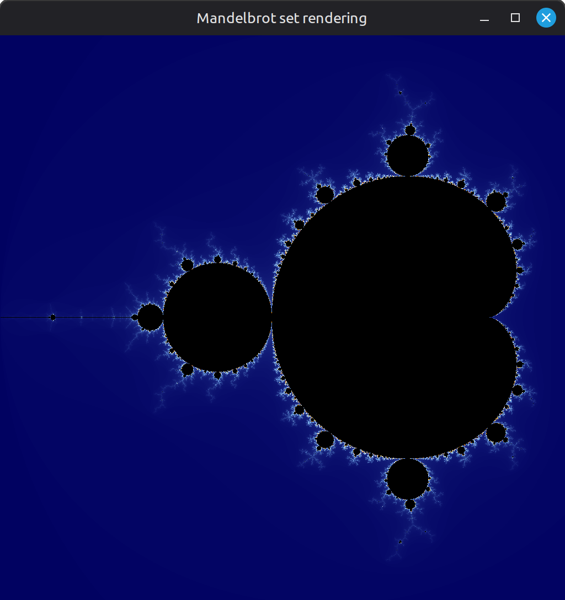
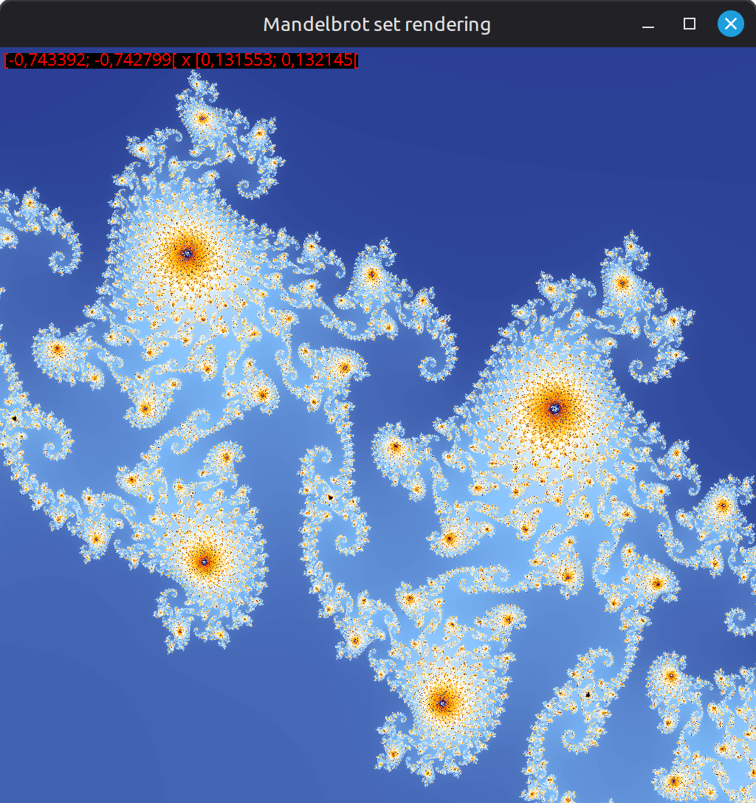
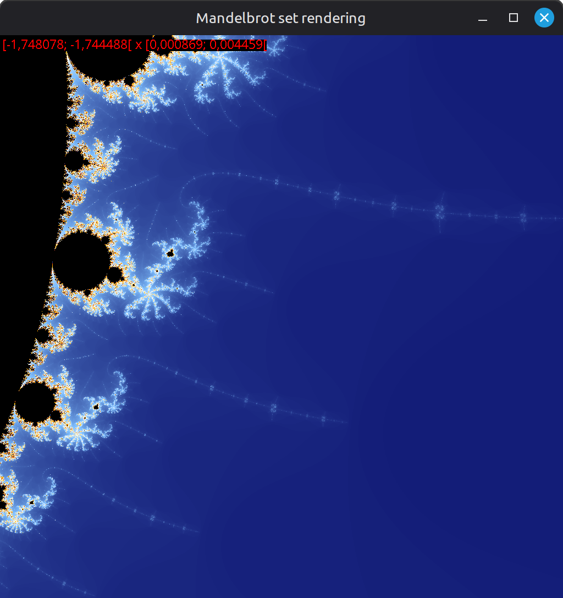
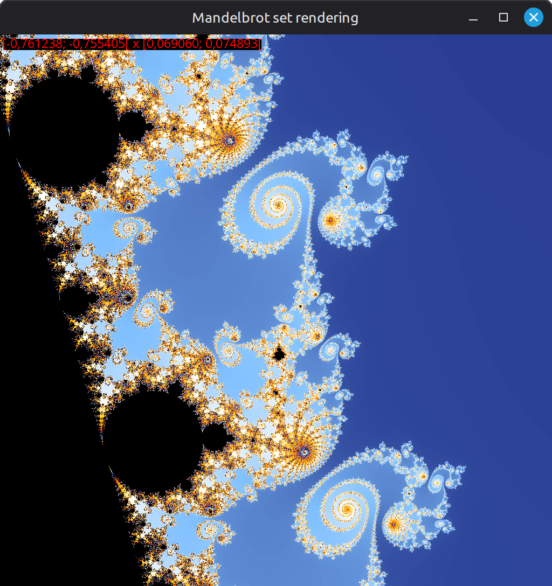
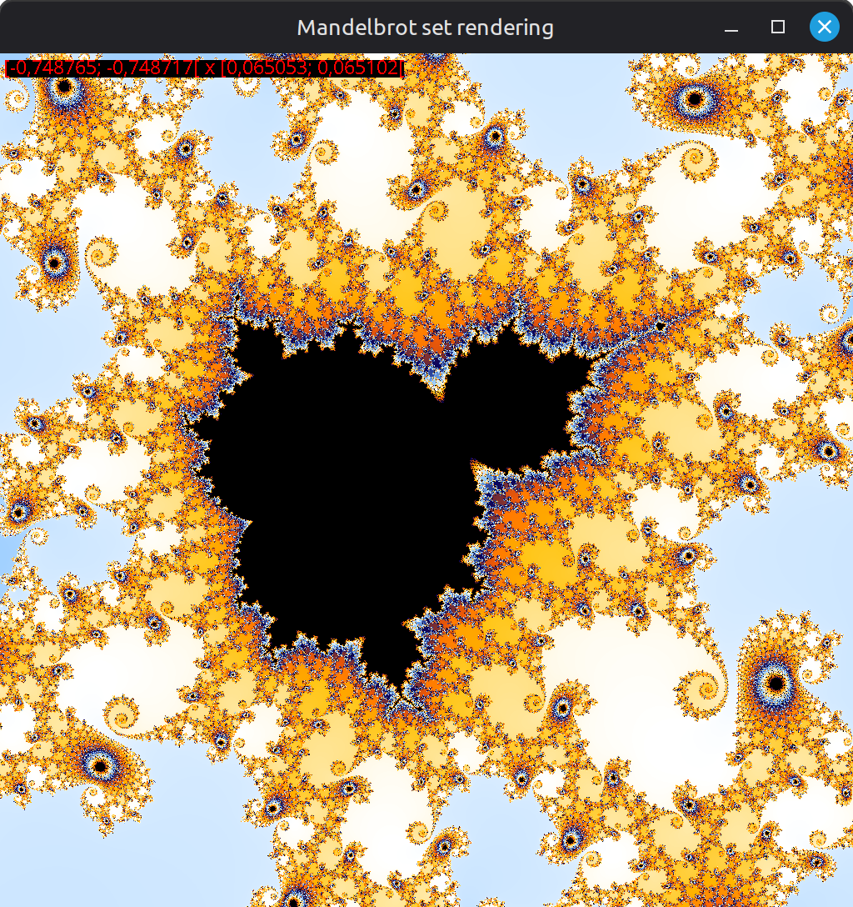

# Mandelbrot CL

Simple Swing animation, allowing to explore the Mandelbrot set.

## Screenshots






## Build and run

Build:
```shell
git clone https://github.com/Achaaab/mandelbrot-cl.git
cd mandelbrot-cl
mvn package
```

Run with OPEN CL, 64 bits :
```shell
java --enable-native-access=ALL-UNNAMED -jar target/mandelbrot-cl.jar OPEN_CL_64
```

Run with OPEN CL, 32 bits :
```shell
java --enable-native-access=ALL-UNNAMED -jar target/mandelbrot-cl.jar OPEN_CL_32
```

Run with CPU and standard instructions :
```shell
java -jar target/mandelbrot-cl.jar CPU
```

Run with CPU and SIMD instructions :
```shell
java --add-modules jdk.incubator.vector -jar target/mandelbrot-cl.jar CPU_SIMD
```

## Controls

- **Zoom in / out**: mouse wheel
- **Move**: mouse drag
- **Increase / decrease depth**: <kbd>Shift</kbd> + mouse wheel
- **Show / hide coordinates**: mouse click

## Requirements

### General requirements

- JDK 25
- Maven 3.6.3+
- Git

### Additional requirements for OPEN_CL_*

#### Linux

##### Debian / Ubuntu

Install the generic OpenCL loader and headers:
```shell
sudo apt install ocl-icd-libopencl1 opencl-headers
```

Then install a vendor-specific OpenCL implementation.

**Intel GPU**
```
sudo apt install intel-opencl-icd
```

**AMD GPU**
```
sudo apt install mesa-opencl-icd
```

For newer AMD GPUs, the proprietary ROCm stack may provide better support.

**NVIDIA GPU**

Install the proprietary NVIDIA driver:
```shell
sudo apt install nvidia-driver
```

The OpenCL runtime is usually included with the driver.

##### Fedora / RHEL / Rocky Linux

Install the generic OpenCL packages:
```shell
sudo dnf install ocl-icd opencl-headers
```

Then install the vendor-specific runtime.

**Intel GPU**
```shell
sudo dnf install intel-compute-runtime
```

**AMD GPU**
```shell
sudo dnf install mesa-libOpenCL
```

ROCm may also be used for recent AMD GPUs.

**NVIDIA GPU**

Install the proprietary NVIDIA driver. On Fedora, this is commonly done through RPM Fusion.

Example:
```shell
sudo dnf install akmod-nvidia
```

The OpenCL runtime is generally included with the NVIDIA driver.

#### Windows

In most cases, no additional installation is required. Installing the latest GPU driver from your hardware vendor is usually sufficient:
- Intel Graphics Driver
- AMD Adrenalin Driver
- NVIDIA GeForce / Studio Driver

OpenCL support is typically included automatically.

To verify installation, you can use:
```shell
clinfo
```

or tools such as `GPU-Z`.

#### macOS

macOS already includes an OpenCL runtime provided by Apple. No additional installation is normally required.

However:
- OpenCL on macOS is deprecated by Apple,
- recent macOS versions may expose limited functionality,
- and support for modern GPU features can vary depending on the hardware.

Apple Silicon systems still provide partial OpenCL compatibility through Apple's implementation.

### Additional requirements for OPEN_CL_64

A device supporting double precision OpenCL operations (FP64).

## Authors
* **Jonathan Guéhenneux** - *Programmer* - [Achaaab](https://github.com/Achaaab)

## License
This project is licensed under the GNU General Public License (GPL) - see the [LICENSE.md](LICENSE.md) for the details.
