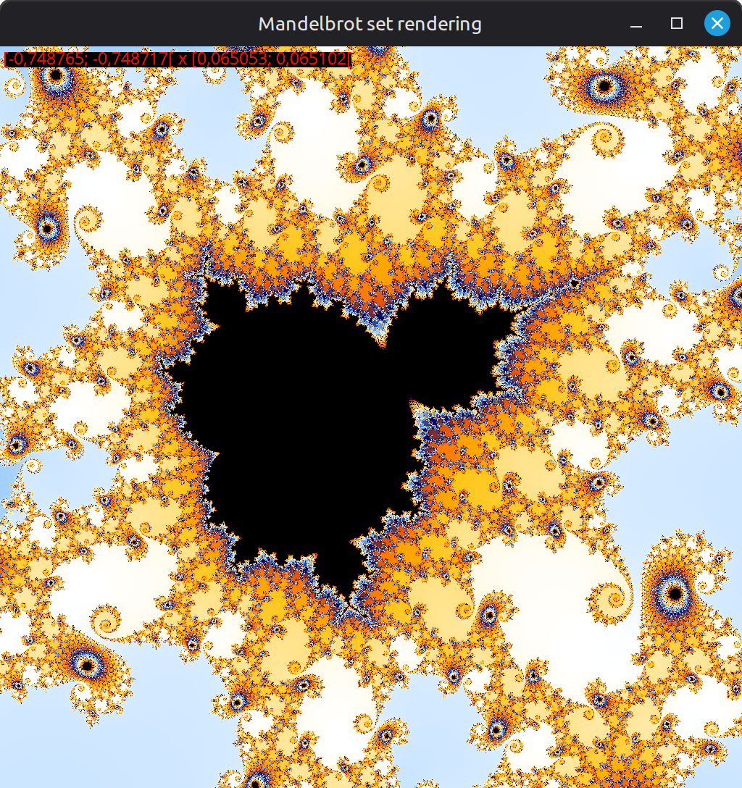

# Mandelbrot CL

Simple Swing animation, allowing to explore the Mandelbrot set.
By default, it uses CPU but a boolean can be set to use OpenCL.

## Requirements

- JDK 25
- Maven 3.6.3+
- Git

## Run it

```shell
git clone https://github.com/Achaaab/mandelbrot-cl.git
cd mandelbrot-cl
mvn package
java -jar target/mandelbrot-cl.jar
```

## Controls

- **Zoom in / out**: mouse wheel
- **Move**: mouse drag
- **Increase / decrease depth**: <kbd>Shift</kbd> + mouse wheel
- **Show / hide coordinates**: mouse click

## Screenshots




## Authors
* **Jonathan Guéhenneux** - *Programmer* - [Achaaab](https://github.com/Achaaab)

## License
This project is licensed under the GNU General Public License (GPL) - see the [LICENSE.md](LICENSE.md) for the details.
